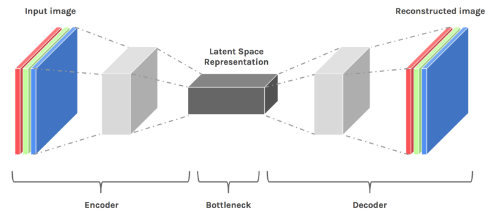
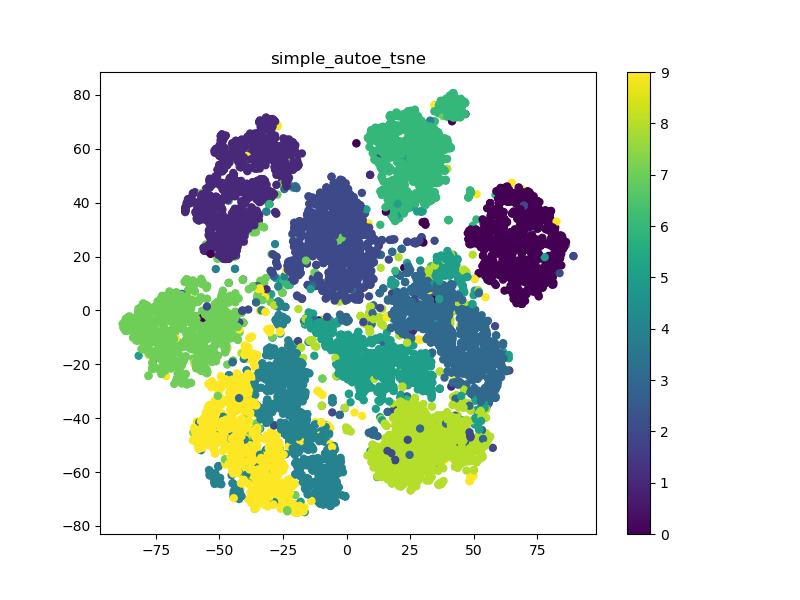
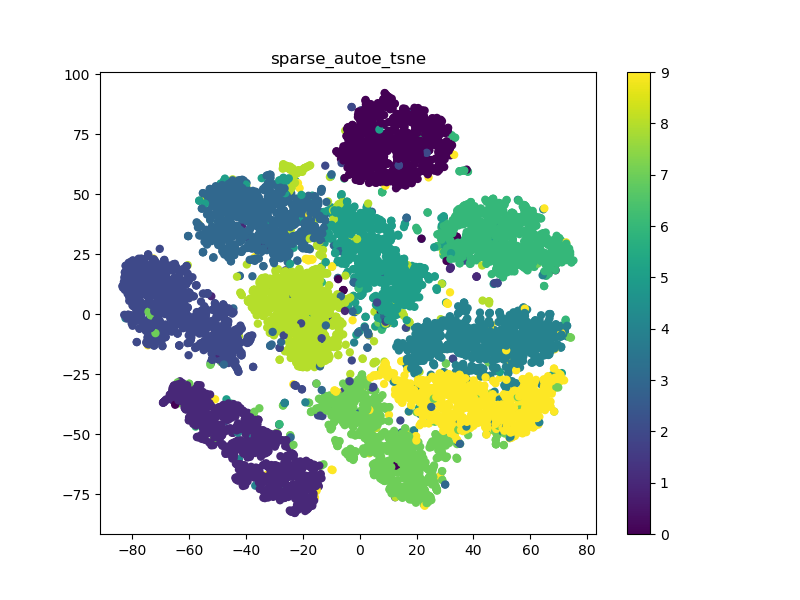
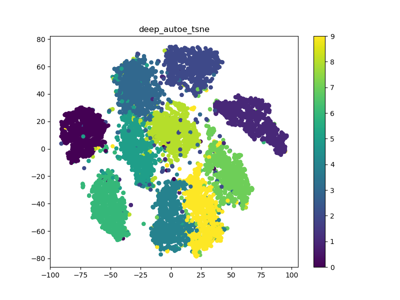
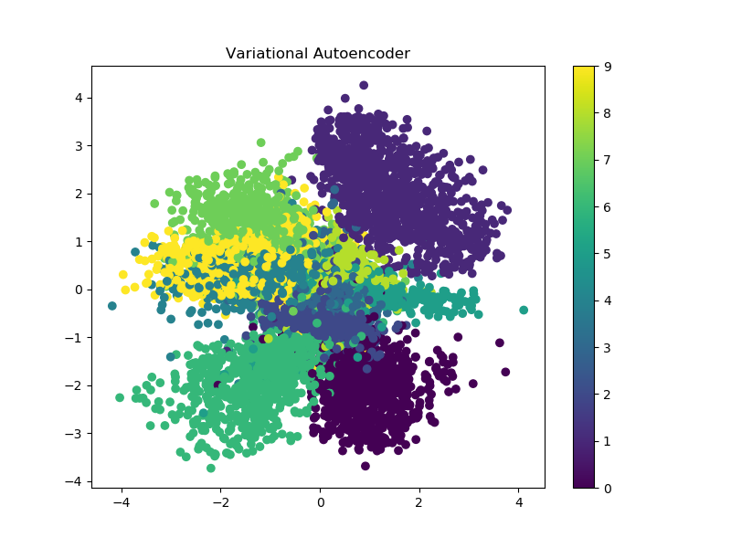

# keras-autoencoders

This github repro was originally put together to give a full set of
working examples of autoencoders taken from the code snippets in
[Building Autoencoders in Keras](https://blog.keras.io/building-autoencoders-in-keras.html).
These examples are:

* A simple autoencoder / sparse autoencoder: simple\_autoencoder.py
* A deep autoencoder: deep\_autoencoder.py
* A convolutional autoencoder: convolutional\_autoencoder.py
* An image denoising autoencoder: image\_desnoising.py
* A variational autoencoder (VAE): variational\_autoencoder.py

All the scripts use the ubiquitous MNIST hardwritten digit data set,
and have been run under Python 3.5 and Keras 2.1.4 with a TensorFlow 1.5
backend, and numpy 1.14.1. Note that it's important to use Keras 2.1.4+
or else the VAE example doesn't work.

## Latent Space Visualization

In order to bring a bit of added value, each autoencoder script saves
the autoencoder's latent space/features/bottleneck in a pickle file.

An autoencoder is made of two components, the encoder and the decoder.
The encoder brings the data from a high dimensional input to a bottleneck
layer, where the number of neurons is the smallest. Then, the decoder takes
this encoded input and converts it back to the original input shape, in
this case an image. The latent space is the space in which the data lies
in the bottleneck layer.

The latent space contains a compressed representation of the image,
which is the only information the decoder is allowed to use to try to
reconstruct the input as faithfully as possible. To perform well, the
network has to learn to extract the most relevant features in the bottleneck.

A great explanation by Julien Despois on Latent space visualization can
be found **[here](https://medium.com/@juliendespois/latent-space-visualization-deep-learning-bits-2-bd09a46920df)**,
and from where I nicked the above explanation and diagram!

The visualizations are created by carrying out dimensionality reduction
on the 32-d (or 128-d) features using t-distributed stochastic neighbor
embedding (t-SNE) to transform them into a 2-d feature which is easy to
visualize.

visualize\_latent\_space.py loads the appropriate feaure, carries out
the t-SNE, saves the t-SNE and plots the scatter graph. Note that at
the moment you have to some commenting/uncommenting to get to run the
appropriate feature :-( .

Here a are some 32-d examples:

And the output from the 2-d VAE latent space output:

 